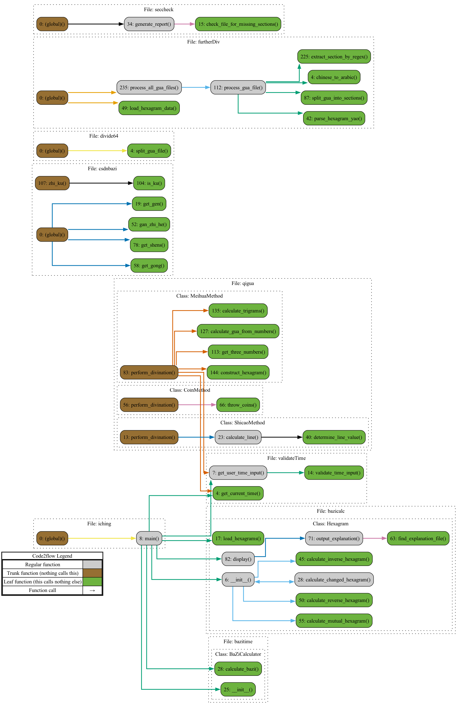

# NEW FEATURE:

To welcome the election day, try entering `make america great again` and `make penn deep blue` in the terminal!*  
*requires lolcat, figlet

Welcome to my I Ching Project! This repository is designed to offer an interactive experience with I Ching (The Book of Changes), 
allowing users to perform traditional divination using methods such as the 50-yarrow stalk method, three-coin toss, or Meihua Yishu. 
The repository also includes tools to calculate BaZi (八字) and the corresponding five elements (五行).

# Next steps

a. ENTIRELY RESTRUCTURE FOR CLARITY, use more class and subclass ✅ 10.23  
b. 纠正山地剥的错误binary code ✅ 10.24  
c. 校对傅佩荣 ✅ 10.27  
d. meihua make 3 3digit nums ✅ 10.24  
e. count and classify jixiong in each yao, rate ✅ 10.30  
f. generate flow chart ✅ 11.2  
g. 加入自然意象 ✅ 11.3  
f. 加入psutil, tqdm ✅ 11.4    

0. BUILDING PostgreSQL database 🔥 expected 11.10
一卦一卦弄 一爻一爻弄 仔细校对好 别着急
-2. check takashima and organize current file sys, cover full book

1. 旺相休囚和生旺墓绝 十二长生
解释: 旺相休囚与生旺墓绝主要是描述天干地支在不同季节和时辰的状态。比如，在某些季节，某个天干是旺的，而在其他季节可能是休的。
现有工具: sxtwl 已经提供了天干地支的计算，但关于旺相休囚和生旺墓绝的具体规则，需要自行编写，基于五行与季节的关联。你可以根据传统的旺相休囚、生旺墓绝规则，用天干地支来映射这些状态。
优势: sxtwl 提供了准确的天干地支和时间处理能力。
劣势: 需要自己实现具体的逻辑，没有现成库完全覆盖这些概念。
https://blog.csdn.net/qq_19598963/article/details/113742307
https://github.com/yanyaming/yxf_yixue_py/blob/master/yxf_yixue/liuyao/_paipan.py

2. 卦分八宫
解释: 八宫即卦象归类。每一卦属于八宫之一（乾、坤、震、巽、坎、离、艮、兑）。
现有工具: 对于八宫的归类，可以在数据文件中直接加入卦象和对应的宫位（或通过简单的分类逻辑实现）。
优势: 简单易实现，不需要复杂逻辑。
劣势: 没有现成的库，只能手动进行分类。

3. 世应
解释: 世爻与应爻是关键爻，用来判断吉凶和事物的起因结果。
现有工具: 没有直接处理世应的库，但你可以通过对每一卦的具体爻位关系进行逻辑判断，将世应分配到对应的爻。
优势: 可以基于简单的爻序实现。
劣势: 没有现成的库，仍然需要自己编写逻辑。

4. 八卦纳甲
解释: 八卦纳甲是将天干地支与八卦卦象对应起来。
现有工具: 你可以通过现有的 sxtwl 库计算天干地支，再根据纳甲规则匹配到八卦。
优势: sxtwl 可以提供基础的天干地支支持。
劣势: 需要手动编写纳甲的匹配规则。

5. 六亲
解释: 六亲是卦象和爻位中的人与事物的代表（比如父母、妻子、兄弟等）。
现有工具: 没有直接处理六亲的库，但六亲的逻辑基于五行相生相克，六亲可以通过自定义规则手动实现。
优势: 基于五行相生相克的规则可以实现。
劣势: 没有现成库，需要自己定义规则。

6. 六神
解释: 六神（青龙、白虎、玄武等）用于进一步判断卦象的具体状态。
现有工具: 没有直接实现六神的库。你可以基于纳甲和六亲的规则自行添加六神。
优势: 可以通过一些静态的对应关系表实现。
劣势: 需要自定义实现，并没有现成库。

7. 用神 元神 忌神 进退神 飞伏神（用神不现） 伏反吟
解释: 用神是卦象中最为关键的爻或元素，代表问题的核心。
现有工具: 没有直接提供用神计算的库。用神的选择取决于问题的性质和卦象的具体爻位，可以通过自定义规则来实现。
优势: 可以通过对卦象的爻位和五行的分析自行选择用神。
劣势: 需要手动确定，没有自动化的工具。

8. 太岁 月建 月破 日辰 日破 空亡
9. 封爻等
10. 45-239

其中 3 4 5 6较为简单 有现成排盘工具可参考
2 基本上就是随手的事情
旺相休囚和生旺墓绝可能比较复杂

都实现之后可以使用用神等进行下一步分析

1. **六神模块**：根据卦象分配六神。
2. **旬空模块**：根据当前的干支旬空进行计算。
3. **神煞模块**：根据特定的干支组合，计算神煞。

DISCLAIMER AND WAIVER OF LIABILITY
WARNING: THE MAKEFILE IN THIS REPOSITORY CONTAINS COMMANDS THAT MAY RESULT IN THE PERMANENT DELETION OF DATA OR SYSTEM DAMAGE.
By accessing and using this repository, including running any commands within the Makefile, you acknowledge and agree to the following:

Assumption of Risk: You understand that the Makefile included in this repository may contain commands that could lead to the irreversible deletion of files, data loss, or system-level changes. Running these commands is entirely at your own risk.

No Liability: Under no circumstances shall the creator(s) or contributors of this repository be liable for any damages, loss of data, or harm resulting from the use of this Makefile, regardless of whether such damages were foreseeable. This includes, but is not limited to, damage to your computer systems, data corruption, or operational failure.

No Warranty: This repository and all files within it are provided "as is," without any warranty, express or implied, including but not limited to the implied warranties of merchantability, fitness for a particular purpose, or non-infringement. The creator(s) of this repository do not guarantee the Makefile will function as expected or without risk.

User Responsibility: By using this repository, you agree to assume all responsibility for any actions you take. You accept full liability for any consequences resulting from running the Makefile or other files, including but not limited to the loss or corruption of data, damage to hardware or software, and security vulnerabilities.

Acknowledgment
By proceeding, you confirm that you have read, understood, and agreed to this disclaimer. You also confirm that you are acting with full awareness of the potential consequences and assume all associated risks.

DO NOT RUN THIS MAKEFILE UNLESS YOU ARE PREPARED FOR PERMANENT DATA LOSS OR SYSTEM DAMAGE. USE ONLY IN A SECURE, ISOLATED ENVIRONMENT FOR TESTING PURPOSES.