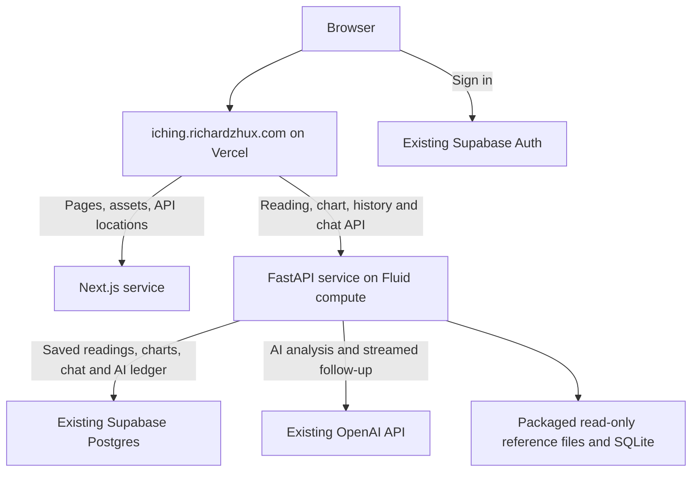

# Render to Vercel migration plan

Prepared October 1, 2026. Status: production cutover and public-domain acceptance complete. Render suspension is the remaining billing step.

## Recommendation

Move the existing FastAPI backend to Vercel, preserve its Python calculation engine, and keep the existing Supabase database and authentication. Prefer **one Vercel project using Services**, with Next.js and FastAPI deployed together at `iching.richardzhux.com`.

This removes the Render hosting dependency and its reported $7/month charge. It also gives each release one frontend/backend pair, one public domain, and one rollback operation. Vercel currently supports FastAPI, Python response streaming, and Services for combining frontend and backend frameworks. Services is available on all plans and remains in beta, so a full preview is the architecture acceptance gate. [FastAPI documentation](https://vercel.com/docs/frameworks/backend/fastapi), [Services documentation](https://vercel.com/docs/services).

If Services fails a concrete compatibility check, deploy FastAPI as a second Vercel project under the same existing team. That still removes Render; the browser can use that backend's URL through the existing API base setting. A TypeScript rewrite of the calculation engine would add substantial work without helping this migration.

The scope is this repository's backend. Account-wide Render retirement also requires identifying every other billable service and its owner before cancellation.

## What the inspection established

| Item | Current evidence | Migration consequence |
| --- | --- | --- |
| Source | Clean `main` before this plan; commit `11ce5c9602d9eef7d56584d1c9cae4cafc4b3262` | A clear baseline for comparing releases |
| Vercel production | `dpl_AJNtRDwmRavckiWEqYVcPXKRAZNB`, READY, matching that commit and serving the custom domain | Preserve this deployment as the initial frontend rollback candidate |
| Backend | `https://iching-p9j9.onrender.com/api/health` returned 200; live OpenAPI exposes the current route families and AI request IDs | Capture its Render deployment ID/SHA before implementation; health alone does not establish its exact commit |
| Frontend | Next.js 16 in `frontend/`; the deployment guide specifies `frontend` as Vercel's project root | Services requires a repository-root deployment configuration |
| Backend | FastAPI application in `src/iching/web/api/main.py`; REST endpoints and SSE chat | Retain the existing API paths and payload contracts |
| Persistence | Existing Supabase project `owgjbdcclemrhgniyhun`, ACTIVE_HEALTHY, region `us-east-2` | Keep its URL, credentials, user IDs, data, and auth setup |
| Database readiness | Live `sessions`, `chat_messages`, `chart_subjects`, `metaphysics_charts`, and `ai_operations` have RLS enabled; both AI accounting RPCs exist; relevant migrations are recorded | No database move is required for this hosting change |
| Reference data | Approximately 1.54 MiB of tracked Python/package data and 4.47 MiB under `data/`, before dependencies and the generated interpretation DB | Source data is small; measure the complete Linux function bundle during the build |
| Sample calculation | Two public calculations using the repository's synthetic 2024-02-10 test date returned 200, 507,833 bytes, schema 7, and the expected BaZi; elapsed times were 0.58s and 0.20s | This sample fits comfortably under Vercel's payload limit; it is not a cold-start or worst-case benchmark |
| Native dependency | Official PyPI metadata for `sxtwl==2.0.7` lists Linux x86-64 wheels for Python 3.12 and 3.13; no 3.14 Linux wheel appeared in that release | Pin the Vercel deployment to Python 3.12 and prove installation/import in the actual Vercel build |

The authenticated Render dashboard confirmed one service (`srv-d47b67qli9vc738jnat0`), deployment `dep-dan6kc7avr4c73a5arh0` at the baseline SHA, one $7/month 512 MB / 0.5 CPU instance, no persistent disk, no secret files, no linked environment groups, and no custom backend domain. Build: `pip install -r requirements.txt`; start: `pip install -e . && uvicorn iching.web.api.main:app --host 0.0.0.0 --port $PORT`. No backend path/model/quota overrides were configured. Auto-deploy was switched off before implementation could reach production. The workspace is free Hobby; billing showed this sole compute charge, $0.19 accrued, and a $7 projected October total. Existing Vercel project settings and production aliases were retrieved through the authenticated REST API. Vercel billing for September 23–October 23 showed $9.85 of the shared $20 infrastructure credit used and $10.15 remaining. Future incremental traffic costs remain an observation item.

## Intended architecture



The browser uses relative API URLs. Public requests route directly to the appropriate Vercel service, avoiding an additional Next.js proxy function for every backend request. Supabase and OpenAI remain the existing data/auth and model providers.

Preserving the public frontend domain also preserves browser-local history. Saved cloud history continues to reference the same Supabase records. Auth redirect URLs should retain the current production domain, with explicit preview URLs added only where testing needs them.

## Required engineering work

### 1. Separate build-time data preparation from runtime reads

There are two concrete startup blockers:

- `src/iching/config.py` calls `build_path_config()` at import and creates data, commentary, and home-directory archive paths through `ensure_directories()`.
- `InterpretationRepository.__init__()` creates the SQLite schema, seeds reference rows, and synchronizes all commentary files. `web/service.py` constructs the session service during import, so this work happens before even the health endpoint can respond.

Make web configuration resolve paths without creating directories. Keep writable directory preparation as an explicit local CLI/tool operation. Web requests should load a packaged database in read-only mode and skip schema creation, seeding, and synchronization.

Generate `data/interpretations.db` during the Vercel build from the tracked source files. The existing `tools/sync_interpretation_db.py` contains the necessary preparation logic; adapt or wrap it in a focused build script. It is currently Git-ignored, so verify that the **generated output is actually included in the deployed function**. An ignored local copy cannot be the production source of truth.

Open the reference databases with an explicit read-only SQLite connection. Validate required files/schema at startup and fail visibly when a build omits them. Missing assets should never silently produce an empty reference database.

Preserve at least:

- `data/guaxiang.txt`, `data/najia.db`, generated `data/interpretations.db`;
- `data/guaci/`, `data/takashima_structured/`, `data/symbolic/`, `data/eng_structured/` where runtime reads require them;
- `src/iching/core/data/*.json`, including statistics baselines and the pattern product catalog;
- `src/iching/core/bazi_rules/bundles/*.json` and their embedded source provenance.

Packaged read-only SQLite is a reference lookup design. Durable mutable application data remains in Supabase, consistent with Vercel's lack of shared persistent local storage. [Vercel storage guidance](https://vercel.com/kb/guide/is-sqlite-supported-in-vercel).

Keep `ICHING_WEB_ARCHIVE_ENABLED=0` for hosted requests. If the Render inventory finds existing disk archives or custom content, export and preserve them before retiring that disk. Temporary function files must never become the saved-history mechanism.

### 2. Package the Python application predictably

Add a small root `app.py` entrypoint that adds this repository's `src/` directory to the import path and exports the existing FastAPI `app`. This keeps the current resource paths rooted in the repository and avoids relocating the engine or duplicating data.

Use a `.python-version` deployment pin of `3.12`; retain the current runtime dependency versions initially. Verify native `sxtwl` imports and timezone data for `Asia/Shanghai` and `America/Los_Angeles` in the Linux build/runtime. [Python runtime documentation](https://vercel.com/docs/functions/runtimes/python), [official sxtwl release files](https://pypi.org/project/sxtwl/2.0.7/#files).

Exclude frontend source/assets/dependencies, local environments, secrets, tests, research source corpora, legacy tools, caches, and documentation from the Python function bundle. Keep required packaged JSON/bundles and generated reference databases. Measure the final uncompressed bundle, import time, cold request, warm request, and peak memory. Use the standard 500 MB Python bundle limit; this app should not need Large Functions.

Do not introduce Redis, another database, a worker subscription, or a queue for the current request-driven flows.

### 3. Route both frameworks correctly

Add a repository-root `vercel.json` for Services and move the frontend build configuration into its service definition. A starting configuration is below; the preview build must confirm the generated entrypoint and service behavior before production use:

```json
{
  "$schema": "https://openapi.vercel.sh/vercel.json",
  "services": {
    "frontend": {
      "root": "frontend/",
      "framework": "nextjs",
      "installCommand": "npm ci",
      "buildCommand": "npm run build"
    },
    "backend": {
      "root": ".",
      "framework": "fastapi",
      "entrypoint": "app:app",
      "buildCommand": "python scripts/build_vercel_backend.py",
      "functions": {
        "app.py": {
          "maxDuration": 300,
          "includeFiles": "{data/**,src/iching/**}",
          "excludeFiles": "{frontend/**,tests/**,research/**,legacy/**,docs/**,tools/**,scripts/**,.git/**,.vercel/**,.venv/**,venv/**,node_modules/**,.cache/**,.env,.env.*,**/__pycache__/**,data/research-baselines/**,data/eng/**,data/takashima/**,references/**}"
        }
      }
    }
  },
  "rewrites": [
    {"source": "/api/locations", "destination": {"service": "frontend"}},
    {"source": "/api/(.*)", "destination": {"service": "backend"}},
    {"source": "/openapi.json", "destination": {"service": "backend"}},
    {"source": "/docs(.*)", "destination": {"service": "backend"}},
    {"source": "/redoc", "destination": {"service": "backend"}},
    {"source": "/(.*)", "destination": {"service": "frontend"}}
  ]
}
```

The existing Next.js `/api/locations` handles both search and coordinate matching. Its exception must precede the FastAPI catch-all. Vercel Services uses the first matching service rule and preserves the original request path, so FastAPI keeps its existing `/api` prefix. Unknown backend routes must return backend 404/405 responses. [Services routing](https://vercel.com/docs/services/routing).

The final routing preserves the existing `/docs`, `/redoc`, and `/openapi.json` backend endpoints explicitly.

Update `frontend/src/lib/env.ts` to support a deliberate same-origin mode with an empty base. Its current production behavior rejects an unset API base. Do not set the base to `/api`, because `api.ts` already appends `/api/...`. Preserve the localhost API override for development and an absolute URL override for the fallback architecture.

Remove or replace the current frontend-only `ignoreCommand`; backend changes currently fall outside its intended directory scope. During migration, build the complete frontend/backend pair on each relevant change. Centralize build overrides so the dashboard, root configuration, and old `frontend/vercel.json` cannot disagree. [Service configuration reference](https://vercel.com/docs/services/config-reference).

### 4. Make runtime behavior work across instances

Retain Supabase as the authoritative source for saved sessions, chart ownership, chat transcripts, quotas, and request replay. `ensure_session_row()` already reads Supabase first, and the deployed AI ledger supports admission and settlement across workers. In-memory session state remains an optimization.

Require a stable `ICHING_CASTING_SECRET` across all Vercel instances. Render had no configured signing value. A new stable value was copied into both approved Vercel projects; the old Render process-generated value is not a cross-host provenance guarantee. Different process-generated fallback secrets can misclassify an untouched casting preview as edited after a request reaches another instance.

The public chart semaphore and per-IP counters are currently per process. Preserve local concurrency admission to protect one instance, and use a shared enforcement mechanism for public request limits: preferably appropriate Vercel firewall rules if included in the team's plan, otherwise a small Supabase-backed admission operation. Verify Vercel's trusted client-IP behavior rather than assuming `request.client.host` contains the browser IP. Preserve the existing test against spoofed forwarding headers. [Vercel request headers](https://vercel.com/docs/headers/request-headers).

Keep the deployed AI request-ID protections. A second instance or a retry must reuse the completed result without issuing another paid model call. A terminated or ambiguous request must retain its reservation; the existing admission function has a 15-minute stale-pending rule and blocks free redispatch.

There is a specific recovery detail to correct or explicitly reconcile: the SQL function returns an existing request's status before running its stale-pending sweep. Retrying only the same abandoned request can therefore keep returning `pending`; a different admission is what reaches the sweep. Add a regression for a terminated worker followed only by same-ID retries. Move safe stale classification ahead of that return, or provide an equivalent reconciliation path, while retaining the reservation and blocking automatic redispatch. A narrowly scoped RPC update should remain compatible with both hosts during overlap.

### 5. Align AI deadlines and streaming

OpenAI clients currently use a 120-second timeout with automatic retries disabled. Ordinary frontend requests default to 30 seconds, including initial AI readings and non-streamed chat. Streaming follow-up uses a separate fetch path.

Start with a 300-second backend function duration and an explicit application deadline below it, leaving time for auth, persistence, and ledger settlement. Set a longer browser timeout for AI operations only, for example 180 seconds after measuring the actual path; keep fast operations bounded separately. Streamed requests need a deliberate total/stall deadline and a visible recovery state.

The SDK timeout alone does not prove a strict total bound for a long stream. Verify slow-provider, disconnect, and hard-termination behavior. Persist completion before sending the terminal SSE event. Avoid relying on shutdown hooks or unawaited work to settle a paid request.

Vercel supports Python streaming; Pro's generally available function-duration ceiling is 800 seconds. Its normal payload limit is 4.5 MB, and default Fluid memory is 2 GB. The proposed 300 seconds is a configured safety envelope, not a reason to lengthen user waits. [Function limits](https://vercel.com/docs/functions/limitations).

### 6. Preserve large chart payloads losslessly

Live acceptance exposed payloads beyond the early sample: a normal female chart is about 4.78 MB and a full-life chart is about 25.4 MB. Plain chart uploads exceed the existing 3 MB API and 2 MiB database caps. Keep those caps and all calculation/rule/provenance fields. Compress JSON responses with standard HTTP gzip, excluding SSE. Compress browser archive snapshots larger than 256 KiB into a strict gzip/base64 envelope; store that representation and transparently reconstruct save/get responses. Bound expansion at 32 MiB, reject malformed or multi-member gzip, and retain legacy plain records.

Verified protected deployment `dpl_Hf1rv1whnsNN7z9bkU4WMxx6fiDm` used Python 3.12.14, native `sxtwl`, the generated 6,078,464-byte reference DB, region `cle1`, Next.js 16.3.6, and the Node locale proxy. A full-life chart traveled as a 1,175,542-byte response and 1,535,827-byte save request and reopened exactly. Real AI concurrency returned 201/429, same-ID replay reused the provider result, SSE completed, both ledger operations settled with zero reservations, and synthetic records were removed. Reference/admission/schema compatibility checks passed. The platform accepted the standard Python bundle; exact peak memory and monthly incremental cost still require operational observation.

## Environment and deployment inventory

Transfer values directly between approved secret stores during implementation; the plan and Git must contain names only.

| Group | Values and treatment |
| --- | --- |
| Backend secrets | `OPENAI_API_KEY`, `OPENAI_PW`, `SUPABASE_SERVICE_KEY`, `ICHING_CASTING_SECRET`; server-side only |
| Existing backend configuration | `SUPABASE_URL`, `ICHING_ENABLE_AI`, `ICHING_AI_MODEL`, `ICHING_CHAT_MODEL`, any currently configured anonymous identity and user/session limits |
| Quotas to preserve | `ICHING_USER_DAILY_TOKEN_LIMIT`, `ICHING_CHAT_TOKEN_LIMIT`, `ICHING_CHAT_TURN_LIMIT`, `ICHING_GLOBAL_DAILY_TOKEN_LIMIT`, `ICHING_CHAT_MESSAGE_LIMIT`, `ICHING_USER_SESSION_LIMIT` |
| Runtime tuning | `ICHING_SESSION_CACHE_LIMIT`, `ICHING_SESSION_CACHE_TTL_SECONDS`, `ICHING_CHART_REQUESTS_PER_MINUTE`, `ICHING_CHART_CONCURRENCY` |
| Hosting paths | Review every `ICHING_*` data/archive path override; replace Render-specific absolute paths with packaged paths; disable web filesystem archives |
| Browser configuration | Retain `NEXT_PUBLIC_SUPABASE_URL` and `NEXT_PUBLIC_SUPABASE_ANON_KEY`; change the API base according to the same-origin implementation |
| Origins and previews | Same-origin production avoids browser API CORS; retain explicit origins for local or separate-project clients. Preview deployments use test credentials/data and deployment protection |

Services shares project environment configuration. Audit Next.js server code/build output so backend credentials never enter public variables or browser bundles. Explicitly scope Production and Preview values; avoid giving arbitrary preview branches production service-role or paid-model credentials.

Choose an initial backend region near Supabase's Ohio location, comparing `cle1` with the current Vercel region `iad1`. Verify service-level region support and the actual deployed region. Multi-region database writes add complexity without a measured need here.

## Cost decision

The existing $20/month Pro fee includes $20 of infrastructure usage credit shared across the team. Additional usage can be billed after that credit is consumed. The team currently contains I Ching, CalRules, Imperial Palace, and Court Disparity Lab, so this app does not have its own separate $20 allowance. [Pro plan](https://vercel.com/docs/plans/pro-plan).

Services uses ordinary function compute pricing. Routing the browser directly to the backend service avoids service-to-service request charges for a Next.js proxy hop; origin transfer remains billable. [Services pricing](https://vercel.com/docs/services/pricing).

At current `cle1`/`iad1` rates, compute is $0.128 per active CPU hour, $0.0106 per GB-hour of provisioned memory, and $0.60 per million invocations. Memory remains billable while a request waits for an external provider. [Function pricing](https://vercel.com/docs/functions/usage-and-pricing).

Illustrations using a 2 GB instance, without concurrency sharing:

| Hypothetical monthly workload | CPU assumption | Request duration | Approximate compute usage cost |
| --- | --- | --- | --- |
| 10,000 quick API requests | 0.1 CPU-second each | 1 second each | $0.10 |
| 1,000 AI requests | 1 CPU-second each | 120 seconds each | $0.74 |
| 10,000 AI requests | 1 CPU-second each | 120 seconds each | $7.43 |

These are calculations, not traffic forecasts or invoice quotes. They exclude origin transfer, builds, storage, other team projects, and OpenAI/Supabase charges. A 0.5 MB chart response also produces about 5 GB of uncompressed response data across 10,000 calls, so track actual transfer alongside compute.

Gross recurring savings are $7/month, or $84/year, for the one reported Render backend. Net savings are **$7 minus any increase in Vercel overage**. If additional backend usage fits within otherwise-unused team credit, the incremental Vercel bill can be zero. Check the team's remaining credit and actual observed usage before calling that a confirmed outcome.

Use a cost acceptance threshold of less than $7/month incremental Vercel overage for this service. Review existing team spend alerts; an automatic team-wide pause affects the other sites too and needs an explicit choice. Keeping Render live for 48 hours of overlap costs approximately $0.47 at a $7/30-day illustrative rate.

## Rollout sequence and completion gates

1. **Inventory and preserve the current state.** Record Render service ID, deployed SHA, Python version, plan, build/start commands, environment names/overrides, disks, cron/workers, auto-deploy, custom domains, and actual charges. Inventory other Render services separately. Record Vercel root/framework settings, environment targets, aliases, and retained rollback deployment. Inspect Supabase auth redirects and the current backup/recovery route. Export any unique disk data. Gate: every durable datum and billed resource has a known owner and destination.

2. **Implement the hosting adaptation on `codex/render-to-vercel`.** Add the entrypoint, build-time DB generation, runtime read-only mode, root Services configuration, same-origin API behavior, timeout adjustments, stable signing configuration, and public admission/IP handling. Update existing deployment documentation. Preserve payload schemas and current calculation behavior. Gate: existing relevant checks and new cross-instance/read-only checks pass.

3. **Deploy and validate a full preview.** Use a temporary Vercel migration project under the existing team so the production project's root configuration remains untouched during the first experiment. Build both services from the same commit, with isolated test data. Confirm bundle files, Python native imports, actual region/duration, Next.js rendering, and real SSE transport. If Services fails a concrete blocker, use the two-project fallback and record that decision. Gate: the acceptance checks below pass against the deployed preview.

4. **Cut over the existing public project.** After preview acceptance, apply the repository-root/Services settings to the existing `iching` project, deploy the tested commit there, and validate that deployment before promotion. A temporary project's deployment cannot simply be promoted into a different project. Preserve the custom domain and Supabase database. Pause Render auto-deploy during the transition and allow in-flight AI operations to finish. Existing open browser tabs contain the old compiled Render API URL: allow a grace period, inspect remaining Render traffic, and provide refresh guidance when those clients encounter retirement. Gate: production serves the tested frontend/backend pair and all critical journeys pass.

5. **Observe, suspend, and retire Render.** The user subsequently requested cancellation of the $7 service charge. After production acceptance, suspend its compute and retain the recoverable service while observing Vercel for 48 hours. Compare errors, latency, SSE completion, ledger states, and Vercel usage. Retain and test complete Vercel deployment pairs before suspension; the historical Render backend cannot decode new compressed snapshots. Confirm the exact migrated Render service is suspended and the app still works. Once archives/settings are preserved and the rollback retention period is settled, remove its billable disk/resources and retire the service. Verify the Render billing page; suspending one service does not establish that the whole account has no remaining charges. [Render billing](https://render.com/pricing).

## Acceptance checks

Reuse existing API, interpretation, session, AI-operation, chart-archive, and frontend contract checks. Run frontend lint/typecheck/build and the existing desktop/mobile journeys. Add focused tests only for migration-specific failures:

- Start the app with write attempts to packaged/reference paths rejected; health, config, reading creation, statistics, and rule/library lookup still work.
- Generate the interpretation DB from a fresh tracked checkout; verify all 64 hexagrams, source counts, special use slots, and generated frontend archive parity.
- Cast a preview in instance A and create its reading in instance B with the same secret; provenance remains correct.
- Create a saved reading/chart with one process, reopen it with an empty cache in another, then continue chat. Test both locales and both signed-in cloud history and signed-out local history.
- Prove duplicate AI request IDs produce at most one provider dispatch across instances; completion replay, changed-request conflicts, pending requests, cancellation, timeout, and uncertain settlement preserve existing accounting semantics.
- Through the deployed public domain, verify `/api/locations` GET and POST, backend paths, authenticated authorization forwarding, 401/403/429 responses, and uncached private responses.
- Observe real incremental SSE chunks and the terminal completion event; test reconnect/retry with the same ID and verify transcript persistence. Unit-test mocked AI failures, then use a small bounded real-provider smoke test during implementation.
- Exercise DST ambiguity, true-solar-time, lunar conversion, period expansion, and unknown-hour inputs using existing fixtures; compare deterministic results with the Render baseline for explicit timestamps.
- Measure cold/warm latency, largest representative response, bundle size, memory, and usage. The current single sample is not the performance acceptance benchmark.

No hosted acceptance check should use another user's records. Keep test records isolated and remove only designated disposable fixtures.

## Rollback and Render retirement

Before retirement, the first rollback is restoring the retained Vercel frontend deployment that uses Render while Render remains live. For the Services build, retain complete frontend/backend deployment pairs and avoid a database schema change in this migration. Restore project root/build settings before rebuilding an older source tree if needed.

New readings created on Vercel remain in the same Supabase database, so returning to Render does not require reverse-copying them. Verify schema compatibility and real reopen/chat behavior during the overlap. After compressed snapshots are saved, the historical Render backend is an incomplete chart rollback. Prefer a complete retained Vercel pair; restoring Render fully requires deploying the new snapshot decoder there before resuming its compute. After Render is deleted, rollback relies on retained Vercel deployments; older Render-dependent frontends are no longer usable rollback targets.

The migration is complete when production has no Render requests, saved data and AI replay work across instances, measured costs meet the agreed threshold, the migrated Render compute charge has stopped, and every remaining Render charge has been either retired or explicitly assigned to another project.

The existing `iching` project now serves complete deployment `dpl_2YhNHuJyX2BxxX8BPn8GSDG2t9DN`, application source `36c449f`, on both `iching.richardzhux.com` and `iching1.vercel.app`. Public-domain acceptance passed authenticated readings, normal/full-life chart exact reconstruction, initial AI concurrent replay, streamed follow-up replay, and durable ledger settlement. No pending or uncertain AI operations remained. All 727 backend checks and 32 desktop/mobile journeys passed. Seventeen initial browser scripts contained no Render URL or private credential values; recent runtime logs showed no 5xx responses. Warm backend health/config requests were approximately 0.095/0.110 seconds in this sample. Exact peak memory and long-term incremental cost remain observation measurements.

Next action: suspend the exact Render service and confirm billing. Retain the complete deployment above for rollback.
